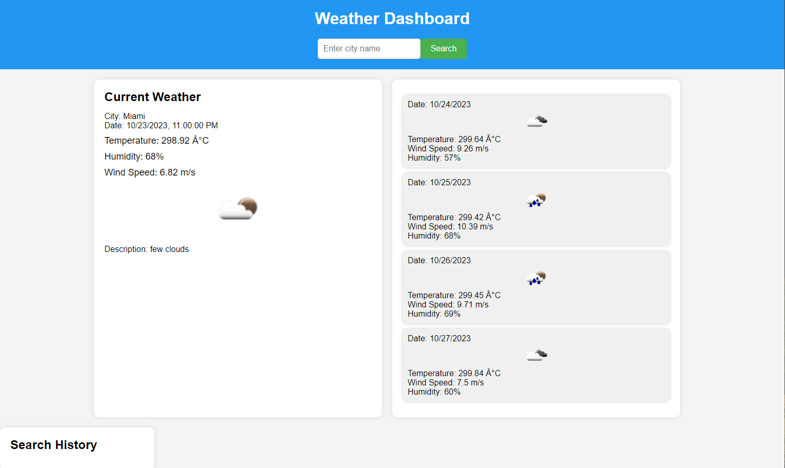

# Weather-Dashboard
This Weather Dashboard is a web application that allows users to search for cities and view current and future weather conditions. It utilizes the OpenWeatherMap API to fetch weather data.

## Demo
 

## Deployed Site
[Weather Dashboard - Live Demo](https://clarisagonzalez.github.io/Weather-Dashboard/)

## Features

- Search for cities and view weather information.
- Display city name, date, temperature, humidity, wind speed, and weather conditions.
- View a 5-day weather forecast with date, temperature, wind speed, and humidity.
- History of previous city searches.

## Usage

- Enter a city name in the input field and click the "Search" button.
- The current weather conditions and 5-day forecast for the city will be displayed.
- The search history on the left side of the dashboard will keep track of your searches.

## License
MIT

